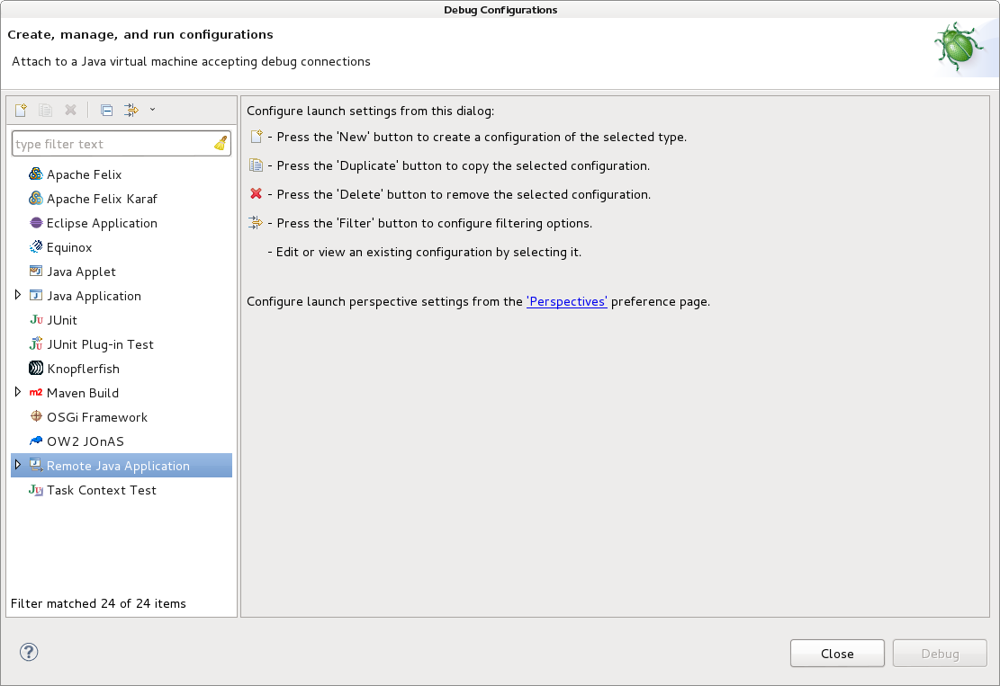
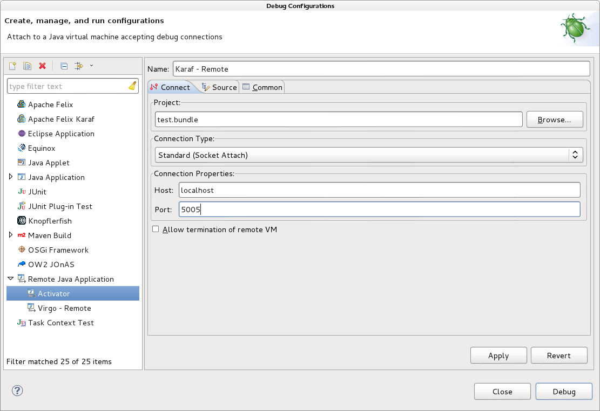
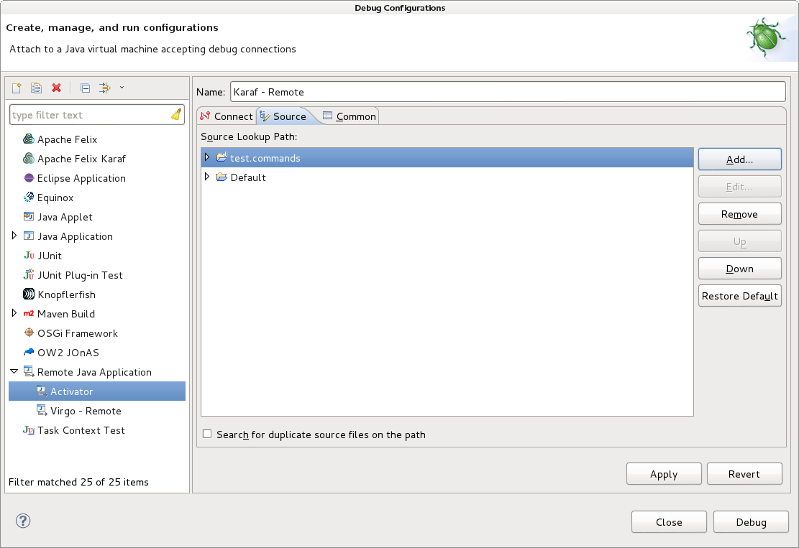

# Debug With Karaf

1. Download Karaf
2. Edit the *etc/org.ops4j.pax.url.mvn.cfg* file:

    1. Add your repositories to the comma delimited list:
    
            org.ops4j.pax.url.mvn.repositories= \
                http://repo1.maven.org/maven2@id=central, \
                http://repository.springsource.com/maven/bundles/release@id=spring.ebr.release, \
                http://repository.springsource.com/maven/bundles/external@id=spring.ebr.external, \
                file:${karaf.home}/${karaf.default.repository}@id=system.repository, \
                file:${karaf.data}/kar@id=kar.repository@multi, \
                http://repo.pennassurancesoftware.com/content/groups/public@id=internal-nexus-repository

    2. Set the Maven settings file to use:

            org.ops4j.pax.url.mvn.settings=${karaf.home}/etc/maven-settings.xml
        
3. Add the maven-settings.xml file to the etc directory:

        <settings xmlns="http://maven.apache.org/SETTINGS/1.0.0" xmlns:xsi="http://www.w3.org/2001/XMLSchema-instance" xsi:schemaLocation="http://maven.apache.org/SETTINGS/1.0.0
            http://maven.apache.org/xsd/settings-1.0.0.xsd">
        
            <servers>
                <server>
                    <id>internal-nexus-repository</id>
                    <username>oss</username>
                    <password>password</password>
                </server>
                <server>
                    <id>internal-nexus-snapshot-repository</id>
                    <username>oss</username>
                    <password>password</password>
                </server>
                <server>
                    <id>internal-nexus-sites-repository</id>
                    <username>oss</username>
                    <password>password</password>
                </server>
                <server>
                    <id>internal-nexus-release-repository</id>
                    <username>oss</username>
                    <password>password</password>
                </server>
            </servers>
        </settings>

2. Start Server
        
        bin/karaf debug clean

3. Install PAX URL Bundles

        pax.url.version=2.1.0
        install -s http://central.maven.org/maven2/org/codehaus/jackson/jackson-core-asl/1.9.13/jackson-core-asl-1.9.13.jar
        install -s http://central.maven.org/maven2/org/ops4j/base/ops4j-base-io/1.4.0/ops4j-base-io-1.4.0.jar
        install -s http://central.maven.org/maven2/org/ops4j/pax/url/pax-url-commons/${pax.url.version}/pax-url-commons-${pax.url.version}.jar
        install -s http://central.maven.org/maven2/org/ops4j/pax/url/pax-url-assembly/${pax.url.version}/pax-url-assembly-${pax.url.version}.jar

4. Install the bundle(s) you will be developing in Eclipse

        install -s assembly:"/home/developer/git/osgi-poc/test.bundle/target/classes"

5. Setup Remote Debugging

    Karaf uses port *5005* for debugging by default.

    1. Open the Eclipse "Debug Configurations" window 
    

    2. Add new "Java Remote Application"
    
        | Property      | Value                                            |
        | ------------- |--------------------------------------------------|
        | Project       | Can be any one of your bundles you are debugging |
        | Host          | localhost                                        |
        | Port          | 5005                                             |
        
        

    3. On the *Source* tab make sure you add any other bundles that you will be debugging on the Karaf Server that you are working on in Eclipse.
    

8. When you make changes to any of the Eclipse projects you are running in Karaf you will need to update the bundle in Karaf while it is running.  This is true whether you are "Remote Debugging" the projects or not.

        update 150

    Note: You will need to find the Bundle ID(s) of your deployed bundle(s)
    
        bundle:list | grep test
        
    That command would give me all the bundles with the word "test" in the name.
    

