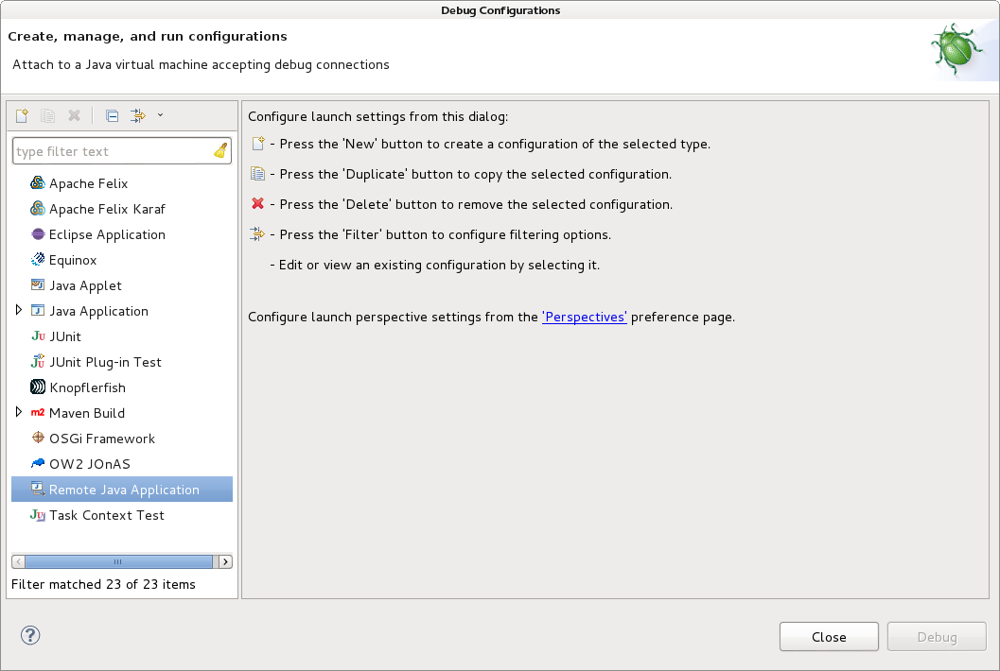
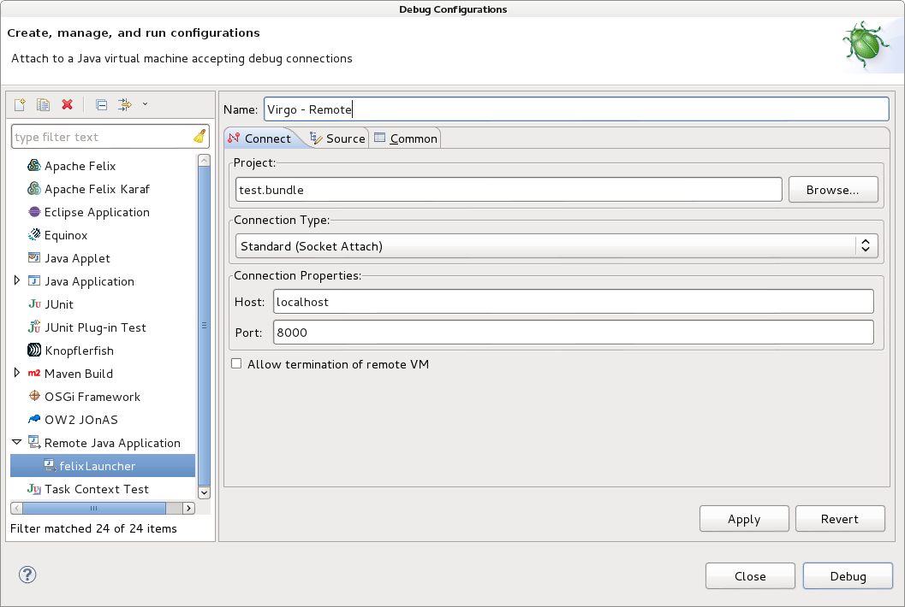
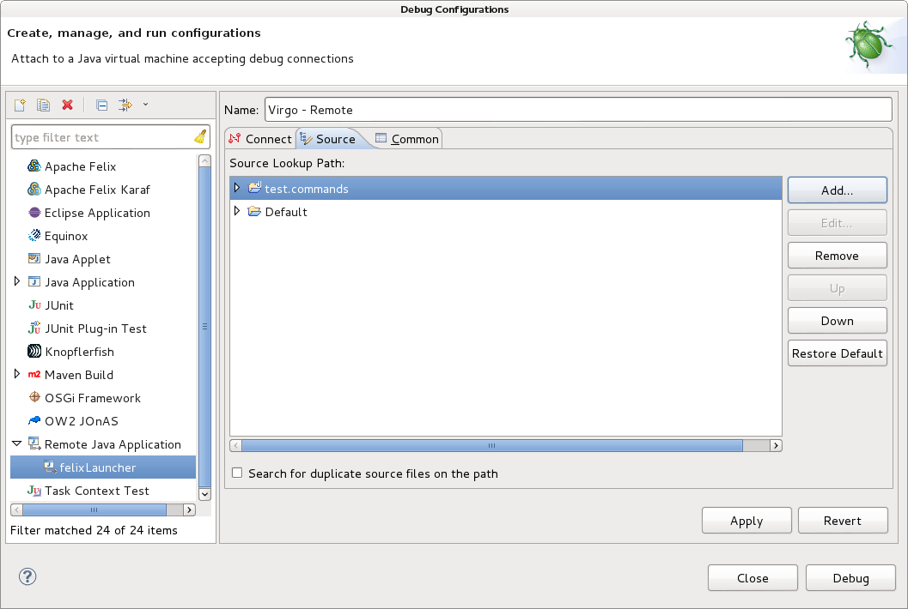

# Debugging With Virgo

Virgo Documentation can be found here <a href="http://www.eclipse.org/virgo/documentation/virgo-documentation-3.6.2.RELEASE/docs/virgo-user-guide/htmlsingle/virgo-user-guide.html#installation">here</a>

1. Download Virgo Tomcat distribution; Extract the folder where you want to install it
2. <del>Edit the *configuration/osgi.console.properties* file:
        ssh.enabled=true
</del>

3. Edit the *repository/ext/osgi.console.properties* file:
 
        ssh.enabled=true

3. Create the file configuration/maven-settings.xml in extracted folder with the following contents:

        <?xml version="1.0" encoding="UTF-8"?>
        <settings xmlns="http://maven.apache.org/SETTINGS/1.0.0" xmlns:xsi="http://www.w3.org/2001/XMLSchema-instance" xsi:schemaLocation="http://maven.apache.org/SETTINGS/1.0.0 http://maven.apache.org/xsd/settings-1.0.0.xsd"> 
            <servers> 
                <server>
                    <id>internal-nexus-repository</id>
                    <username>oss</username>
                    <password>password</password>
                </server>
                <server>
                    <id>internal-nexus-snapshot-repository</id>
                    <username>oss</username>
                    <password>password</password>
                </server>
                <server>
                    <id>internal-nexus-sites-repository</id>
                    <username>oss</username>
                    <password>password</password>
                </server>
                <server>
                    <id>internal-nexus-release-repository</id>
                    <username>oss</username>
                    <password>password</password>
                </server>
            </servers>
        </settings>

        
3. Start the server
     
        bin/startup.sh -debug -clean -Djava.protocol.handler.pkgs=org.ops4j.pax.url -Dorg.ops4j.pax.url.mvn.settings=configuration/maven-settings.xml -Dorg.ops4j.pax.url.mvn.repositories=http://repo.pennassurancesoftware.com/content/groups/public@id=internal-nexus-repository,http://repo.pennassurancesoftware.com/content/groups/public-snapshots@id=internal-nexus-repository@snapshots

4. SSH to console

        ssh admin@localhost -p 2502
        password: springsource

5. Install PAX URL Bundles

         pax.url.version=2.1.0
         install -start http://central.maven.org/maven2/org/ops4j/base/ops4j-base-lang/1.4.0/ops4j-base-lang-1.4.0.jar
         install -start http://central.maven.org/maven2/org/ops4j/base/ops4j-base-monitors/1.4.0/ops4j-base-monitors-1.4.0.jar
         install -start http://central.maven.org/maven2/org/ops4j/base/ops4j-base-io/1.4.0/ops4j-base-io-1.4.0.jar
         install -start http://central.maven.org/maven2/org/codehaus/jackson/jackson-core-asl/1.9.13/jackson-core-asl-1.9.13.jar
         install -start http://central.maven.org/maven2/org/ops4j/pax/swissbox/pax-swissbox-core/1.7.1/pax-swissbox-core-1.7.1.jar
         install -start http://central.maven.org/maven2/org/ops4j/base/ops4j-base-util-property/1.4.0/ops4j-base-util-property-1.4.0.jar
         install -start http://central.maven.org/maven2/org/ops4j/pax/swissbox/pax-swissbox-property/1.7.1/pax-swissbox-property-1.7.1.jar         
         install -start http://central.maven.org/maven2/org/ops4j/pax/url/pax-url-commons/${pax.url.version}/pax-url-commons-${pax.url.version}.jar
         install -start http://central.maven.org/maven2/org/ops4j/pax/url/pax-url-assembly/${pax.url.version}/pax-url-assembly-${pax.url.version}.jar
         install -start http://central.maven.org/maven2/org/ops4j/pax/url/pax-url-aether/${pax.url.version}/pax-url-aether-${pax.url.version}.jar
         # install -start http://central.maven.org/maven2/org/ops4j/pax/url/pax-url-wrap/${pax.url.version}/pax-url-wrap-${pax.url.version}.jar

6. Install the bundle(s) you will be working on from Eclipse:

        install -start assembly:"/home/developer/git/osgi-poc/test.bundle/target/classes"

    Note: You will want to point to the directory that Eclipse uses to build the files for the bundle's project.

7. Setup Remote Debugging

    Virgo uses port *8000* for debugging by default.

    1. Open the Eclipse "Debug Configurations" window 
    

    2. Add new "Java Remote Application"
    
        | Property      | Value                                            |
        | ------------- |--------------------------------------------------|
        | Project       | Can be any one of your bundles you are debugging |
        | Host          | localhost                                        |
        | Port          | 8000                                             |
        
        

    3. On the *Source* tab make sure you add any other bundles that you will be debugging on the Virgo Server that you are working on in Eclipse.
    

8. When you make changes to any of the Eclipse projects you are running in Virgo you will need to update the bundle in Virgo while it is running.  This is true whether you are "Remote Debugging" the projects or not.

        update 150

    Note: You will need to find the Bundle ID(s) of your deployed bundle(s)
    
        ss | grep test
        
    That command would give me all the bundles with the word "test" in the name.
    
